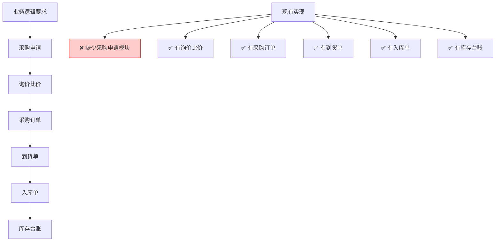
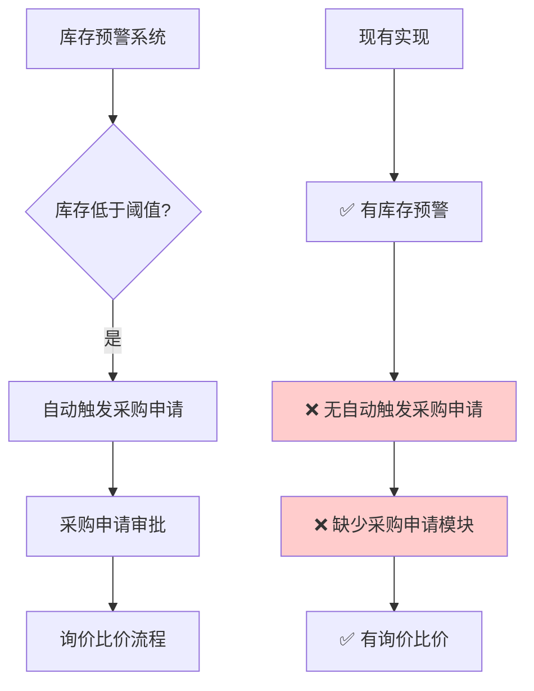
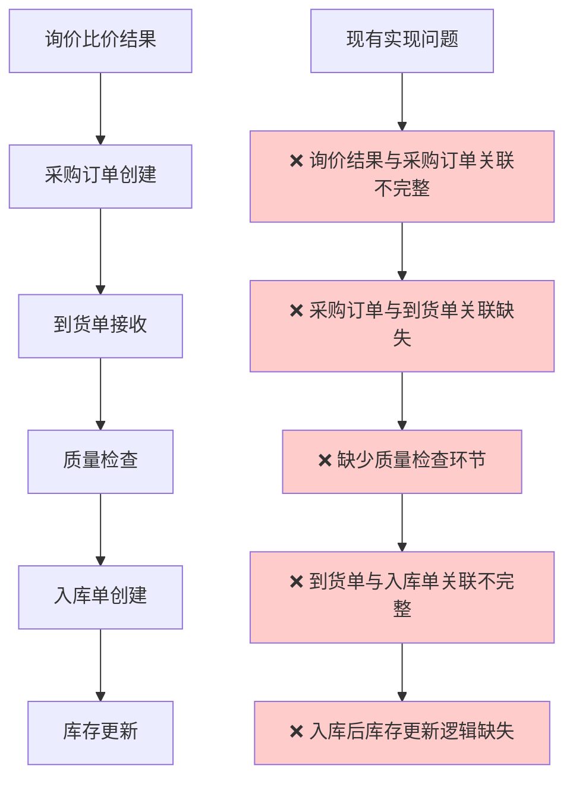
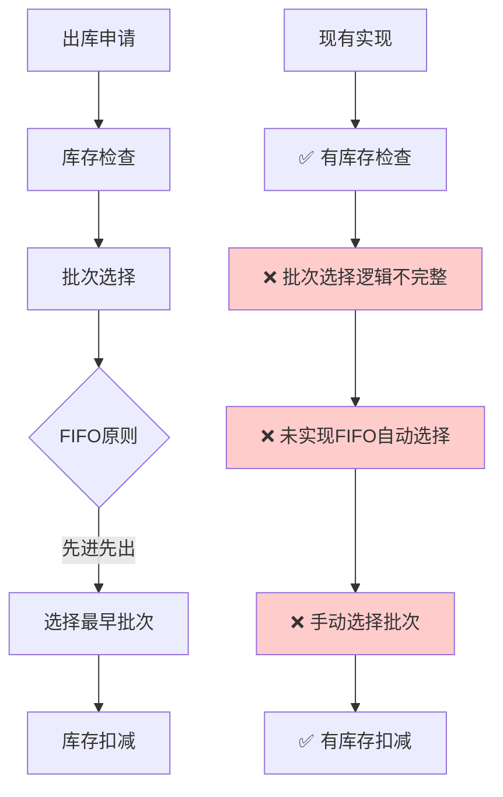
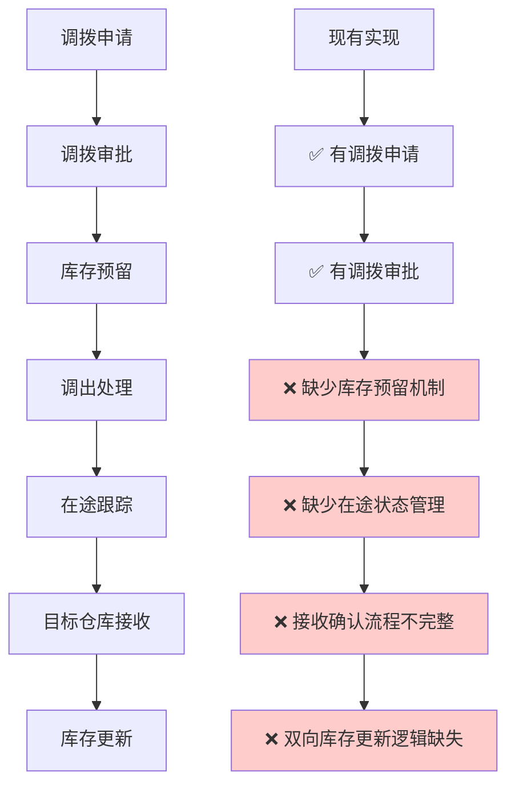
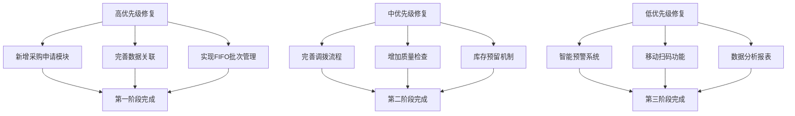

# 库存管理系统问题分析报告

## 📋 检查概述

基于《库存管理系统业务逻辑说明.md》文档，对现有React Admin系统进行了全面检查，发现了多个与业务逻辑不符的问题。

## 🔍 主要问题流程图

### 1. 核心业务流程缺失问题



### 2. 库存预警与采购申请集成问题



### 3. 数据关联和集成问题



### 4. 批次管理FIFO原则问题



### 5. 调拨流程状态管理问题



## 🚨 具体问题详细分析

### 1. 缺失的核心模块

#### ❌ 采购申请模块
- **问题描述**: 业务逻辑要求有采购申请模块，但现有系统直接从询价比价开始
- **影响**: 无法实现库存预警自动触发采购申请的完整流程
- **建议**: 新增采购申请模块，包含申请单创建、审批流程等

#### ❌ 质量检查环节
- **问题描述**: 到货单接收后缺少质量检查环节
- **影响**: 无法保证入库物料质量，缺少质量追溯
- **建议**: 在到货单和入库单之间增加质量检查环节

### 2. 数据关联问题

#### ❌ 询价结果与采购订单关联
```typescript
// 现有采购订单类型缺少询价关联
interface ProcurementOrder {
  // 缺少以下字段
  inquiryId?: string;           // 询价单ID
  quotationId?: string;         // 选中报价ID
  quotationComparison?: any;    // 比价结果
}
```

#### ❌ 采购订单与到货单关联
```typescript
// 现有到货单类型关联不完整
interface DeliveryNote {
  purchaseOrderNo: string;  // 仅有订单号，缺少完整关联
  // 缺少以下字段
  purchaseOrderId?: string;     // 采购订单ID
  orderItems?: ProcurementItem[]; // 订单明细对比
}
```

### 3. 业务逻辑实现问题

#### ❌ FIFO批次管理
- **问题**: 出库时未自动按先进先出原则选择批次
- **现状**: 手动选择批次，容易造成库存积压
- **建议**: 实现自动FIFO批次选择算法

#### ❌ 库存预留机制
- **问题**: 调拨申请审批后未预留库存
- **现状**: 可能出现调拨时库存不足的情况
- **建议**: 实现库存预留和释放机制

### 4. 状态管理问题

#### ❌ 调拨在途状态
```typescript
// 现有调拨状态缺少在途管理
type TransferStatus = 'draft' | 'pending' | 'approved' | 'rejected' | 'transferred' | 'received';
// 缺少 'in_transit' 状态的详细管理
```

#### ❌ 库存实时更新
- **问题**: 入库、出库、调拨后库存更新逻辑不完整
- **现状**: 可能出现库存数据不一致
- **建议**: 实现事务性库存更新机制

### 5. 高级功能缺失

#### ❌ 智能预警系统
- **问题**: 缺少多维度预警（有效期、库龄、成本）
- **现状**: 仅有基础库存数量预警
- **建议**: 实现智能预警算法

#### ❌ 移动扫码功能
- **问题**: 缺少PDA/手机扫码出入库功能
- **现状**: 仅有基础的库存管理界面
- **建议**: 开发移动端扫码应用

## 🔧 修复建议流程图

### 优先级修复流程



## 📊 问题统计

| 模块 | 检查项目 | 符合度 | 主要问题 |
|------|----------|--------|----------|
| 库存台账 | ✅ 90% | 基本功能完整，缺少库龄分析 |
| 批次管理 | ⚠️ 70% | 缺少FIFO自动选择 |
| 入库管理 | ⚠️ 75% | 缺少质量检查环节 |
| 出库管理 | ⚠️ 70% | 批次选择逻辑不完整 |
| 调拨管理 | ❌ 60% | 在途状态管理缺失 |
| 采购集成 | ❌ 50% | 缺少采购申请模块 |
| 预警系统 | ⚠️ 65% | 智能化程度不足 |

## 🎯 总结

现有系统已实现了库存管理的基础功能，但在业务流程完整性、数据关联性和智能化方面还有较大改进空间。建议按照优先级分阶段进行修复和完善，以达到业务逻辑文档的要求。